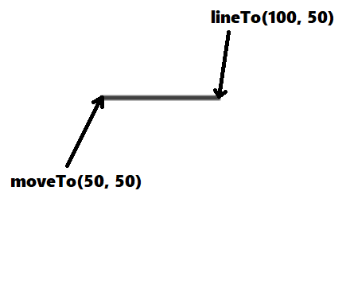

## Video

| Name_Video | Video_Link | Channel |
|:---:|:---:|:---:|
|Учим HTML5 Canvas за 30 минут!|[HTML5 Canvas](https://www.youtube.com/watch?v=XYgcNVwHUdg)| Хауди Хо |

#### Time: 20:41

## Canvas

| Constant | Contain | Description |
|:---:|---|:---:|
|**canvas**|document.getElementById('canvas')| Got HTML-canvas element|
|**context**|canvas.getContext('2d')| Use for 2D|

## Useful Methods

|Used Constant|Method|Type|Data Type|Description|Image|
|:---:|:---:|:---:|:---:|:---:|:---:|
|context|`fillStyle`|variable|string|Object's background color||
|context|`fillRect`|function( x, y, width, height )|x:number, y:number, width:number, height:number |Create full-filled rectangle||
|context|`strokeRect`|function( x, y, width, height )|x:number, y:number, width:number, height:number |Create border - rectangle||
|context|`strokeStyle`|variable|string|Border color||
|context|`strokeRect`|variable|number|Border width||
|context|`arc`|function( centerX, centerY, radius, startAngle, endAngle, antiClock)| centerX:number, centerY:number, radius:number, startAngle:number, endAngle:number, antiClock:boolean |Create fill - Arc||
|context|`fill`|function()|void| Show/trace 'fill' objects |1) No-fill:  2) Fill: |
|context|`beginPath`|function()|void| Initialize the start coordinates(x,y) of object ||
|context|`closePath`|function()|void| Drag a line to initial coordinates(x,y) of object. The dot initialized with beginPath() | 1) Before closePath():  2) After closePath()  |
|context|`moveTo`|function( x, y )| x:number, y:number | Move start pen to coordinates(x,y) |  |
|context|`lineTo`|function( x, y )| x:number, y:number | Drag a line from the previous coordinates of pen(x,y) to coordinates of lineTo(x,y) ||
|context|`stroke`|function()|void| Create all dragged lines |  |
|context|`scale`|function( x, y )| x:number, y:number | Resizes an element | 1) scale(1,1):  2) scale(2,2)  |
